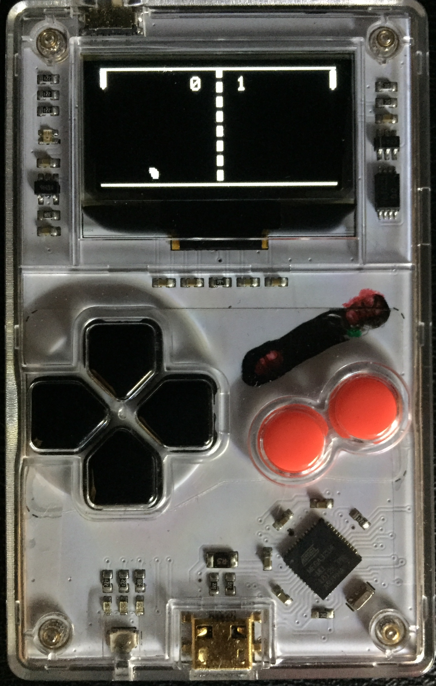

# Pong
This game is the arduboy version of pong

For more information about arduboy, see [this page](https://arduboy.com/).

This game is only the first version of the code, so it is very ugly !

**How to play :** Default mode is one player game, to play on two player mode, go to settings, then check the checkbox for "Player 2"

**Controls :**
- Player 1:
    - **[Up]** & **[Down]** arrows
- Player 2
    - **[A]** & **[B]** Buttons

**Mute** this function is not disponibl yet

|Main menu|Game menu|Settings|Game|
|---------|---------|--------|----|
|||||

## Download

latest release [available here](). ;)

For more, checkout [GitHub repo](https://github.com/lostsh/arduboy_pong-game) then enjoy playing Pong !